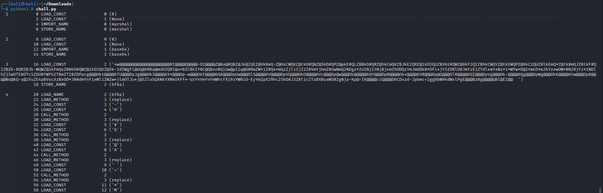
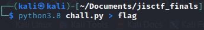
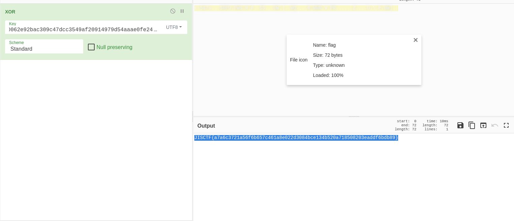

# marshal reverse challenge 

This write up is from JISCTF Finals for the reverse engineering challenge with 100 point written in python.

this challenge was solved using python 3.8.5 it won't be solved using other verions
```
import marshal

exec(marshal.loads(b'\xe3\x00\x00\x00\x00\x00\x00\x00\x00\x00\x00\x00\x00\x00\x00\x00\x00\x06\x00\x00\x00@\x00\x00\x00sX\x00\x00\x00d\x00d\x01l\x00Z\x00d\x00d\x01l\x01Z\x01d\x02Z\x02e\x02\xa0\x03d\x03d\x04\xa1\x02\xa0\x03d\x05d\x06\xa1\x02\xa0\x03d\x07d\x08\xa1\x02\xa0\x03d\td\n\xa1\x02\xa0\x03d\x0bd\x0c\xa1\x02Z\x02e\x04e\x00\xa0\x05e\x01\xa0\x06e\x02\xa1\x01\xa1\x01\x83\x01\x01\x00d\x01S\x00)\r\xe9\x00\x00\x00\x00Nad\x03\x00\x004w@@@@@@@@@@@@@@@@@@@@BI@@@@Q@@@@-O2@@@@Z@Ba@#QBZ@Jk@2QEZ@VkBmQ-Z@hkCWQKZ@tkD#QNZ@5kD#QPZ@pkE#QLZBBkD#QRZ@5kCmQKZBJkE2QRZ@1kD2QUZBVkE#QWZ@9kF2QIZBhkCWQYZ@tkEWQPZ@9kC2QUZBlkEmQ*Z@tk#mQJZBtkF#QIZBZk-#QRZBJk-WQWZ@1kFmQeZBNkD#QWZ@1kD2QVZ@5k-2dIWgFl@UQ@XRRa@mUDZQRl@o*BZCBkIY0C@QBxn#QiUw@pI1q@O#RmZW*1Z#Q4*mQzZjliZjI2Z#VmYjhmZ#UwNmQ2NDgz*2U1NjI3NjBj*mZhODQzYmJmODk0*DFi*jY5ZDRlO#JmYzE1ZTdl*mYxNz*1*WYw*D@2*mU5*mJhYz*wOW*0N2RjYz*1NDlhZjIwOTE0OTc5ZDU0YWFhZTBmZTI0ZDPpcg@@@Okt@@@@6TU@@@DpJg@@@Ok3@@@@6X*@@@Dp-w@@@OkF@@@@6Q8@@@DpUw@@@OlS@@@@6V@@@@DpVQ@@@OkO@@@@6Vc@@@Dp@w@@@Ok@@@@@6QY@@@DpB@@@@Ok*@@@@6V0@@@Dp@Q@@@OlR@@@@6QI@@@DpVg@@@Ok-@@@@6Qg@@@DpWg@@@OkK@@@@6Vw@@@Dp#@@@@No@KQ-a@2VuZE4pBVocXzBxOD*3N#dmYnF1eWliZWZw*jlmOTJu*j@5ZloSQXNkYXNkOXFf*-UzYnVmYnFmWhtfX19zYWRiO-EyYmZpX29hc25kO#J3Z#lic2TaBXByaW502gNja-Kp@-Ik@@@@ciQ@@@D6CDxzd-Jpbmc+2gg8bW9kdWxlPgE@@@BzBg@@@@QBl@EI@@  \xfa\x01-\xda\x01H\xfa\x01#\xda\x01G\xfa\x01@\xda\x01A\xfa\x01 \xfa\x01=\xda\x01*\xda\x01M)\x07\xda\x07marshal\xda\x06base64Z\x04bf8a\xda\x07replace\xda\x04exec\xda\x05loadsZ\tb64decode\xa9\x00r\x11\x00\x00\x00r\x11\x00\x00\x00\xfa\x08<string>\xda\x08<module>\x01\x00\x00\x00s\x08\x00\x00\x00\x08\x01\x08\x01\x04\x01,\x01'))
```
as you can see it's calling marshal module.

marshel module contains functions that can read and write Python values in a binary format.

here the code is calling `marshal.loads` and inside of it there is a serialized bytes-like object.

the function marshal.loads converts the serialized bytes-like object to a Python code object, then the exec function is called to execute that python code object.

Let's extract the marshalled code object and try to disassemble it with the `dis` module:

```
import marshal

code=(marshal.loads(b'\xe3\x00\x00\x00\x00\x00\x00\x00\x00\x00\x00\x00\x00\x00\x00\x00\x00\x06\x00\x00\x00@\x00\x00\x00sX\x00\x00\x00d\x00d\x01l\x00Z\x00d\x00d\x01l\x01Z\x01d\x02Z\x02e\x02\xa0\x03d\x03d\x04\xa1\x02\xa0\x03d\x05d\x06\xa1\x02\xa0\x03d\x07d\x08\xa1\x02\xa0\x03d\td\n\xa1\x02\xa0\x03d\x0bd\x0c\xa1\x02Z\x02e\x04e\x00\xa0\x05e\x01\xa0\x06e\x02\xa1\x01\xa1\x01\x83\x01\x01\x00d\x01S\x00)\r\xe9\x00\x00\x00\x00Nad\x03\x00\x004w@@@@@@@@@@@@@@@@@@@@BI@@@@Q@@@@-O2@@@@Z@Ba@#QBZ@Jk@2QEZ@VkBmQ-Z@hkCWQKZ@tkD#QNZ@5kD#QPZ@pkE#QLZBBkD#QRZ@5kCmQKZBJkE2QRZ@1kD2QUZBVkE#QWZ@9kF2QIZBhkCWQYZ@tkEWQPZ@9kC2QUZBlkEmQ*Z@tk#mQJZBtkF#QIZBZk-#QRZBJk-WQWZ@1kFmQeZBNkD#QWZ@1kD2QVZ@5k-2dIWgFl@UQ@XRRa@mUDZQRl@o*BZCBkIY0C@QBxn#QiUw@pI1q@O#RmZW*1Z#Q4*mQzZjliZjI2Z#VmYjhmZ#UwNmQ2NDgz*2U1NjI3NjBj*mZhODQzYmJmODk0*DFi*jY5ZDRlO#JmYzE1ZTdl*mYxNz*1*WYw*D@2*mU5*mJhYz*wOW*0N2RjYz*1NDlhZjIwOTE0OTc5ZDU0YWFhZTBmZTI0ZDPpcg@@@Okt@@@@6TU@@@DpJg@@@Ok3@@@@6X*@@@Dp-w@@@OkF@@@@6Q8@@@DpUw@@@OlS@@@@6V@@@@DpVQ@@@OkO@@@@6Vc@@@Dp@w@@@Ok@@@@@6QY@@@DpB@@@@Ok*@@@@6V0@@@Dp@Q@@@OlR@@@@6QI@@@DpVg@@@Ok-@@@@6Qg@@@DpWg@@@OkK@@@@6Vw@@@Dp#@@@@No@KQ-a@2VuZE4pBVocXzBxOD*3N#dmYnF1eWliZWZw*jlmOTJu*j@5ZloSQXNkYXNkOXFf*-UzYnVmYnFmWhtfX19zYWRiO-EyYmZpX29hc25kO#J3Z#lic2TaBXByaW502gNja-Kp@-Ik@@@@ciQ@@@D6CDxzd-Jpbmc+2gg8bW9kdWxlPgE@@@BzBg@@@@QBl@EI@@  \xfa\x01-\xda\x01H\xfa\x01#\xda\x01G\xfa\x01@\xda\x01A\xfa\x01 \xfa\x01=\xda\x01*\xda\x01M)\x07\xda\x07marshal\xda\x06base64Z\x04bf8a\xda\x07replace\xda\x04exec\xda\x05loadsZ\tb64decode\xa9\x00r\x11\x00\x00\x00r\x11\x00\x00\x00\xfa\x08<string>\xda\x08<module>\x01\x00\x00\x00s\x08\x00\x00\x00\x08\x01\x08\x01\x04\x01,\x01'))

dis.dis(code)
```

here is the results:



after extracting the marshalled code it gave us some weird string and it's calling an intresting methoed `replace`.

it seems that it's taking that weird string and replacing some characters in the strings with other character.

```
             22 LOAD_METHOD              3 (replace)
             24 LOAD_CONST               3 ('-')
             26 LOAD_CONST               4 ('H')
             28 CALL_METHOD              2
             30 LOAD_METHOD              3 (replace)
             32 LOAD_CONST               5 ('#')
             34 LOAD_CONST               6 ('G')
             36 CALL_METHOD              2
             38 LOAD_METHOD              3 (replace)
             40 LOAD_CONST               7 ('@')
             42 LOAD_CONST               8 ('A')
             44 CALL_METHOD              2
             46 LOAD_METHOD              3 (replace)
             48 LOAD_CONST               9 (' ')
             50 LOAD_CONST              10 ('=')
             52 CALL_METHOD              2
             54 LOAD_METHOD              3 (replace)
             56 LOAD_CONST              11 ('*')
             58 LOAD_CONST              12 ('M')
```
after  replacing all the characters in the weird string we have, i ended up with this base64.

```
4wAAAAAAAAAAAAAAAAAAAABIAAAAQAAAAHO2AAAAZABaAGQBZAJkA2QEZAVkBmQHZAhkCWQKZAtkDGQNZA5kDGQPZApkEGQLZBBkDGQRZA5kCmQKZBJkE2QRZA1kD2QUZBVkEGQWZA9kF2QIZBhkCWQYZAtkEWQPZA9kC2QUZBlkEmQMZAtkGmQJZBtkFGQIZBZkHGQRZBJkHWQWZA1kFmQeZBNkDGQWZA1kD2QVZA5kH2dIWgFlAUQAXRRaAmUDZQRlAoMBZCBkIY0CAQBxnGQiUwApI1qAOGRmZWM1ZGQ4MmQzZjliZjI2ZGVmYjhmZGUwNmQ2NDgzM2U1NjI3NjBjMmZhODQzYmJmODk0MDFiMjY5ZDRlOGJmYzE1ZTdlMmYxNzM1MWYwMDA2MmU5MmJhYzMwOWM0N2RjYzM1NDlhZjIwOTE0OTc5ZDU0YWFhZTBmZTI0ZDPpcgAAAOktAAAA6TUAAADpJgAAAOk3AAAA6XMAAADpHwAAAOkFAAAA6Q8AAADpUwAAAOlSAAAA6VAAAADpVQAAAOkOAAAA6VcAAADpAwAAAOkAAAAA6QYAAADpBAAAAOkMAAAA6V0AAADpAQAAAOlRAAAA6QIAAADpVgAAAOkHAAAA6QgAAADpWgAAAOkKAAAA6VwAAADpGAAAANoAKQHaA2VuZE4pBVocXzBxODM3NGdmYnF1eWliZWZwMjlmOTJuMjA5ZloSQXNkYXNkOXFfMHUzYnVmYnFmWhtfX19zYWRiOHEyYmZpX29hc25kOGJ3ZGlic2TaBXByaW502gNjaHKpAHIkAAAAciQAAAD6CDxzdHJpbmc+2gg8bW9kdWxlPgEAAABzBgAAAAQBlAEIAA==
```
of course at first i tried to decode it using cyberchef but it's no use, it's a Python code object after all we can't read it after decoding it.

we can read that base64 with `dis` module but in this case using this function `co_consts`

```
import marshal
import base64

code=(marshal.loads(base64.b64decode("4wAAAAAAAAAAAAAAAAAAAABIAAAAQAAAAHO2AAAAZABaAGQBZAJkA2QEZAVkBmQHZAhkCWQKZAtkDGQNZA5kDGQPZApkEGQLZBBkDGQRZA5kCmQKZBJkE2QRZA1kD2QUZBVkEGQWZA9kF2QIZBhkCWQYZAtkEWQPZA9kC2QUZBlkEmQMZAtkGmQJZBtkFGQIZBZkHGQRZBJkHWQWZA1kFmQeZBNkDGQWZA1kD2QVZA5kH2dIWgFlAUQAXRRaAmUDZQRlAoMBZCBkIY0CAQBxnGQiUwApI1qAOGRmZWM1ZGQ4MmQzZjliZjI2ZGVmYjhmZGUwNmQ2NDgzM2U1NjI3NjBjMmZhODQzYmJmODk0MDFiMjY5ZDRlOGJmYzE1ZTdlMmYxNzM1MWYwMDA2MmU5MmJhYzMwOWM0N2RjYzM1NDlhZjIwOTE0OTc5ZDU0YWFhZTBmZTI0ZDPpcgAAAOktAAAA6TUAAADpJgAAAOk3AAAA6XMAAADpHwAAAOkFAAAA6Q8AAADpUwAAAOlSAAAA6VAAAADpVQAAAOkOAAAA6VcAAADpAwAAAOkAAAAA6QYAAADpBAAAAOkMAAAA6V0AAADpAQAAAOlRAAAA6QIAAADpVgAAAOkHAAAA6QgAAADpWgAAAOkKAAAA6VwAAADpGAAAANoAKQHaA2VuZE4pBVocXzBxODM3NGdmYnF1eWliZWZwMjlmOTJuMjA5ZloSQXNkYXNkOXFfMHUzYnVmYnFmWhtfX19zYWRiOHEyYmZpX29hc25kOGJ3ZGlic2TaBXByaW502gNjaHKpAHIkAAAAciQAAAD6CDxzdHJpbmc+2gg8bW9kdWxlPgEAAABzBgAAAAQBlAEIAA==")))

print(code.co_consts)
```
here i decoded the base64 string and then called the function `loads` from the `marshal`, put the results into `code` variable and used the `co_consts` on the variable.

the output of the code:
```('8dfec5dd82d3f9bf26defb8fde06d64833e562760c2fa843bbf89401b269d4e8bfc15e7e2f17351f00062e92bac309c47dcc3549af20914979d54aaae0fe24d3', 114, 45, 53, 38, 55, 115, 31, 5, 15, 83, 82, 80, 85, 14, 87, 3, 0, 6, 4, 12, 93, 1, 81, 2, 86, 7, 8, 90, 10, 92, 24, '', ('end',), None)```

we have this string `8dfec5dd82d3f9bf26defb8fde06d64833e562760c2fa843bbf89401b269d4e8bfc15e7e2f17351f00062e92bac309c47dcc3549af20914979d54aaae0fe24d3` and these decimal numbers `114, 45, 53, 38, 55, 115, 31, 5, 15, 83, 82, 80, 85, 14, 87, 3, 0, 6, 4, 12, 93, 1, 81, 2, 86, 7, 8, 90, 10, 92, 24`

at first i tried to convert these decimal number in cyberchef and xor it with the srting we got.

```
JISCTF{a7a6c375e20`i;cid2b8lnj,
```
we've got some progress here but it's not enough.

then i tried to execute the base64 that we have and save the results into a file.

```
import marshal

import base64

exec(source)(marshal.loads(base64.b64decode("4wAAAAAAAAAAAAAAAAAAAABIAAAAQAAAAHO2AAAAZABaAGQBZAJkA2QEZAVkBmQHZAhkCWQKZAtkDGQNZA5kDGQPZApkEGQLZBBkDGQRZA5kCmQKZBJkE2QRZA1kD2QUZBVkEGQWZA9kF2QIZBhkCWQYZAtkEWQPZA9kC2QUZBlkEmQMZAtkGmQJZBtkFGQIZBZkHGQRZBJkHWQWZA1kFmQeZBNkDGQWZA1kD2QVZA5kH2dIWgFlAUQAXRRaAmUDZQRlAoMBZCBkIY0CAQBxnGQiUwApI1qAOGRmZWM1ZGQ4MmQzZjliZjI2ZGVmYjhmZGUwNmQ2NDgzM2U1NjI3NjBjMmZhODQzYmJmODk0MDFiMjY5ZDRlOGJmYzE1ZTdlMmYxNzM1MWYwMDA2MmU5MmJhYzMwOWM0N2RjYzM1NDlhZjIwOTE0OTc5ZDU0YWFhZTBmZTI0ZDPpcgAAAOktAAAA6TUAAADpJgAAAOk3AAAA6XMAAADpHwAAAOkFAAAA6Q8AAADpUwAAAOlSAAAA6VAAAADpVQAAAOkOAAAA6VcAAADpAwAAAOkAAAAA6QYAAADpBAAAAOkMAAAA6V0AAADpAQAAAOlRAAAA6QIAAADpVgAAAOkHAAAA6QgAAADpWgAAAOkKAAAA6VwAAADpGAAAANoAKQHaA2VuZE4pBVocXzBxODM3NGdmYnF1eWliZWZwMjlmOTJuMjA5ZloSQXNkYXNkOXFfMHUzYnVmYnFmWhtfX19zYWRiOHEyYmZpX29hc25kOGJ3ZGlic2TaBXByaW502gNjaHKpAHIkAAAAciQAAAD6CDxzdHJpbmc+2gg8bW9kdWxlPgEAAABzBgAAAAQBlAEIAA==")))
```


after that i uploaded the file info cyberchef xor it with the string we got the flag



this challnge took me some time to solve it, it was really fun to solve it and learned alot from it.
