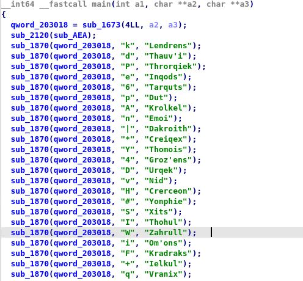

# omega-one

in this challenge we have an output file that contains some random names

```
Crerceon 
Ezains   
Ummuh
Zonnu
Vinzo
Cuzads
Emoi
Ohols
Groz'ens
Ukox
Ehnu 
.
.
.
etc
```
and an excutable file _omega-one_, I have tried to excute it but didn't have any thing special.

let open it in _IDA_ shall we.


