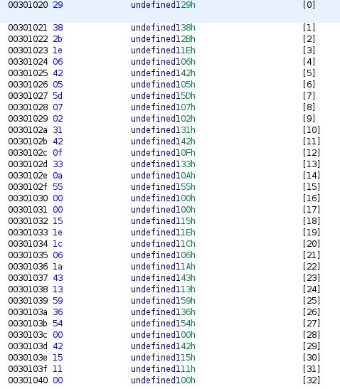
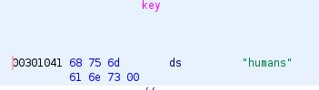
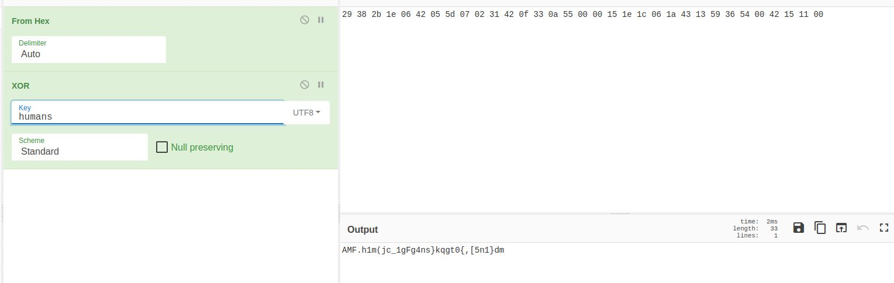
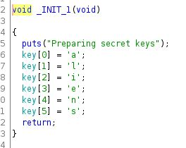
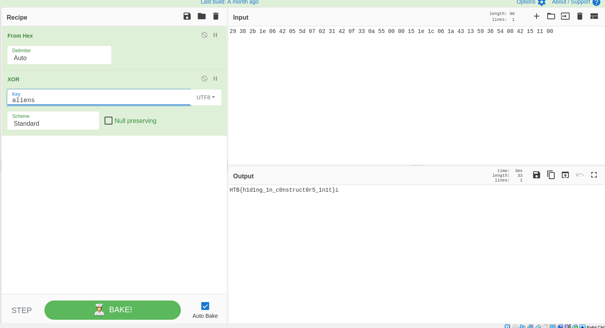

# rebuilding

rebuilding is an easy Reverse challenge.

In this challenge we only have an excutable file called _rebuilding_

tried executing it, it needs to be executed with some argument.


as shown in the picture it says that the length of the argument is not correct.

it's like there is a condition in the elf file that checks the length of the argument.

lets open it with _ghidra_.


from ghidra we find out that the length we need is 32 from the if statment we have here.
 ```
 if (Password_length == 32)
 
 ```
 there is 2 for loops in the main funcion, there is an intresting operation that's being called in the end.
 
 ```
       local_14 = local_14 +
                 (uint)((byte)(encrypted[i] ^ key[i % 6]) ==
                       *(byte *)((long)i + *(long *)(param_2 + 8)))
 ```
 
 in this operation it's calling 2 variable `encrypted` and `key`.
 
 it is calling the variable `key` and xor it with the variable `encrypted`
 
let see what these variables are.



it seems that `encrypted` variable contains a hex values.

```
29 38 2b 1e 06 42 05 5d 07 02 31 42 0f 33 0a 55 00 00 15 1e 1c 06 1a 43 13 59 36 54 00 42 15 11 00
```



and the key variable contains the word `humans` as shown.

lets go to cyberchef to make that xor operation.



well that's not our flag of course there is somthing missing, back when we executed the file it printed

```
Preparing secret keys
```


it doesn't seems to be in the `main` funtion, there is something being called befor the `main` function.

the only funcions that are being execued befor the main functions are the `constructors` aka in `_init_`.



now everythings is alright we found another key in the `_init_` function

```
aliens
```
now let's try the xor again with our new key



Voilà, we finlly got the flag.

