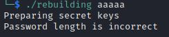
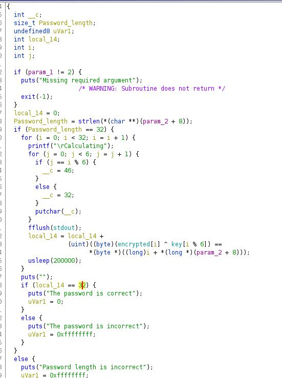

# rebuilding

rebuilding is an easy Reverse challenge.

In this challenge we only have an excutable file _rebuilding_

tried executing it, it needs to be executed with some argument.



as shown in the picture it say that the length of the argument is not correct.

it's like there is a condition in the elf file that checks the length of the argument.

let open it with _ghidra_.



from ghidra we find out that the length we need is 32 from the if statment we have here.
 ```
 if (Password_length == 32)
 
 ```
 there is 2 for loops in the main funcion, there is an intresting operation that's being called in the end of the first loop
 
 ```
       local_14 = local_14 +
                 (uint)((byte)(encrypted[i] ^ key[i % 6]) ==
                       *(byte *)((long)i + *(long *)(param_2 + 8)))
 ```
 
 in this operation it's calling 2 variable `encrypted` and `key`.
 
 it is calling the `key` and xor it with the `encrypted`
                       
