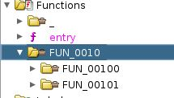

# Teleport

Teleport is a medium reverse challenge.

in this challenge we only have an elf file.

lets see what we get when we execute it.

```
./teleport       
Missing password
```
ok it needs an argument.

```
./teleport aaa
Something's wrong...
```
nothing special with the out put, also i have tried ltrace but it was useless

lets open _ghidra_ and see what we got.

we don't have main function because the elf file is stripped.

```
teleport: ELF 64-bit LSB pie executable, x86-64, version 1 (SYSV), dynamically linked, interpreter /lib64/ld-linux-x86-64.so.2, for GNU/Linux 3.2.0, BuildID[sha1]=fe96e54a3cc59c165d21aa34f9b9355e88e2d7d0, stripped
```
after going to the enrty we have this funcion being executed first `FUN_00101696`.

```
{
  int password_length;
  undefined8 uVar1;
  uint local_10;
  
  if (param_1 == 2) {
    strncpy(&DAT_00303280,*(char **)(param_2 + 8),100);
    for (local_10 = 0; local_10 < 0x2b; local_10 = local_10 + 1) {
      (*(code *)(&PTR_FUN_00303020)[(int)local_10])();
    }
    password_length = _setjmp((__jmp_buf_tag *)&DAT_003031a0);
    if (password_length == 100) {
      puts("Looks good to me!");
    }
    else {
      if (password_length != 101) {
                    /* WARNING: Subroutine does not return */
        longjmp((__jmp_buf_tag *)(&DAT_00303300 + (long)password_length * 200),1);
      }
      puts("Something\'s wrong...");
    }
    uVar1 = 0;
  }
  else {
    puts("Missing password");
    uVar1 = 0xffffffff;
  }
  return uVar1;
}
```

it seems that the password is 100 character that's usual for a reverse challenege

anyway, there is 2 files in the funtion symbol tree.



these 2 files contains alot of functions. 

i checked _FUN_00100b2a_ funtion and it seems it contains one of the flag characters.
```

void FUN_00100b2a(void)

{
  int iVar1;
  
  iVar1 = _setjmp((__jmp_buf_tag *)&DAT_00304048);
  if (iVar1 == 0) {
    return;
  }
  if (DAT_00303291 == 't') {
                    /* WARNING: Subroutine does not return */
    longjmp((__jmp_buf_tag *)&DAT_003031a0,18);
  }
                    /* WARNING: Subroutine does not return */
  longjmp((__jmp_buf_tag *)&DAT_003031a0,0x65);
}
```

we the letter `t` and there is a number with if statment that contains that letter `18`

this number is the position of the letter `t` in the flag.

every function in these 2 files are the same, it contains a letter from the flag and a number that represnts the position of that letter.

after going through all the of the functions and putting every character in the right position we will end up with this flag.

_HTB{h0pp1ng_thru_th3_sp4c3_t1m3_c0nt1nuum!}_


