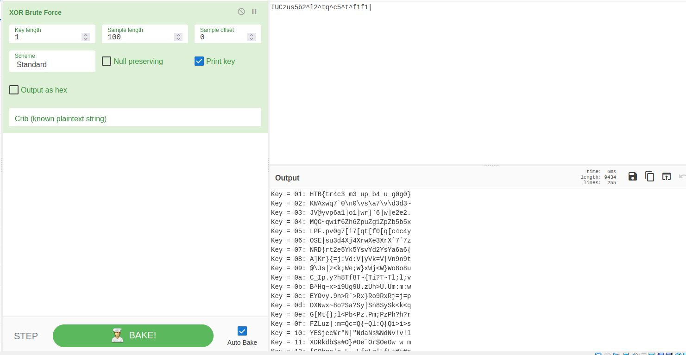

# without a trace


without a trace is an easy reverse challenge

we have only an elf file 

this is what i got after executing it .

```
[+] Primary Mothership Tracking Panel
[X] Unusual activity detected
 |-------] Unrecognised login location: Earth
[X] Please verify your identity by entering your password > aaa
[X] Intruder detected - dispatching security systems
```

with ltrace

```
puts("[+] Primary Mothership Tracking "...[+] Primary Mothership Tracking Panel
)                                             = 38
puts("[X] Unusual activity detected"[X] Unusual activity detected
)                                                   = 30
puts(" |-------] Unrecognised login lo"... |-------] Unrecognised login location: Earth
)                                             = 46
printf("[X] Please verify your identity "...)                                           = 60
fgets([X] Please verify your identity by entering your password > aaaaa
"aaaaa\n", 64, 0x7f95a7fc79a0)                                                    = 0x7ffeadd71d80
strchr("aaaaa\n", '\n')                                                                 = "\n"
ptrace(0, 0, 0, 0)                                                                      = -1
strcmp("aaaaa", "IUCzus5b2^l2^tq^c5^t^f1f1|")                                           = 24
printf("[X] Intruder detected - dispatch"...)                                           = 52
[X] Intruder detected - dispatching security systems+++ exited (status 255) +++
```
ok we have strcmp function, it is comparing our input with a key `IUCzus5b2^l2^tq^c5^t^f1f1|`

tried executing the file with the key i gotbut it was useless

```
[+] Primary Mothership Tracking Panel
[X] Unusual activity detected
 |-------] Unrecognised login location: Earth
[X] Please verify your identity by entering your password > IUCzus5b2^l2^tq^c5^t^f1f1|
[X] Intruder detected - dispatching security systems
```

without ghidra or IDA went straight forward to cyberchef and tried alot of thing with that key.

finally got the flag just by the using xor brute force operation



_HTB{tr4c3_m3_up_b4_u_g0g0}_
